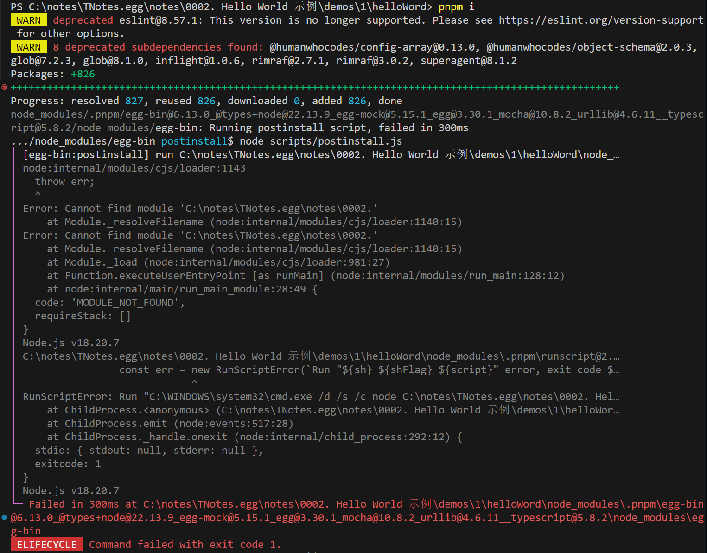

# [0002. Hello World 示例](https://github.com/Tdahuyou/TNotes.egg/tree/main/notes/0002.%20Hello%20World%20%E7%A4%BA%E4%BE%8B)

<!-- region:toc -->
- [1. 📒 概述](#1--概述)
- [2. 💻 准备必要的环境](#2--准备必要的环境)
- [3. 💻 安装 Egg.js 脚手架工具](#3--安装-eggjs-脚手架工具)
- [4. 💻 项目初始化](#4--项目初始化)
<!-- endregion:toc -->

## 1. 📒 概述

- 这篇笔记介绍了基于 Egg.js 搭建一个简单的 "Hello World" 示例的详细步骤，从零开始逐步完成。
- 我们将通过命令行工具创建项目，并实现一个基本的 API 接口 `/hello`。
- 在项目搭建的过程中，会用到官方的脚手架 `egg-init`。

## 2. 💻 准备必要的环境

- 在开始之前，请确保你的开发环境满足以下要求：
  1. 已安装 Node.js（建议使用 LTS 版本，如 v16 或 v18）。
  2. 已安装 `npm` 或 `yarn` 或 `pnpm` 包管理工具。（或者其他的包管理工具）
- 可以通过以下命令检查版本：

```bash
node -v
npm -v
```

## 3. 💻 安装 Egg.js 脚手架工具

- Egg.js 提供了一个官方的脚手架工具 `egg-init`，用于快速生成项目结构。
- 运行以下命令全局安装 `egg-init`：

```bash
npm install egg-init -g

# 安装完成后，可以通过以下命令验证是否成功：
egg-init --version
```

- `2025年3月6日16:51:12` 目前的最新版本是 `3.1.0`。
- 

## 4. 💻 项目初始化

- 使用 `egg-init` 创建一个新的 Egg.js 项目。假设项目名称为 `helloWorld`：

```bash {2,11,12,16}
# 使用 egg-init 创建一个新的 Egg.js 项目，目名称为 helloWorld。
egg-init helloWorld --type=simple
# 执行后一路回车。


# --type=simple 表示使用简单模板。
# 执行命令后，脚手架会自动生成项目文件夹和初始代码。


# 切换到项目目录，并安装依赖。
cd helloWorld
npm i


# 启动开发服务器（支持热更）
npm run dev

# 启动成功后，终端会显示类似以下内容：
# [egg:core] App started at http://127.0.0.1:7001
# 此时，你可以打开浏览器访问 http://127.0.0.1:7001，默认会看到一个欢迎页面。
```

- ⚠️ 安装依赖报错：
  - 如果在 npm i 安装依赖的过程中出现了类似下面这样的错误：
  - 
  - 很可能是因为路径问题导致的，应尽量使用 纯英文路径 ，避免中文、空格和特殊字符。
  - 如果是 Windows 环境的话，还得注意路径不能太长。